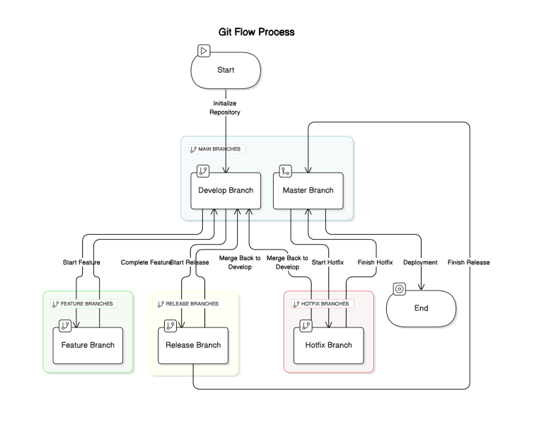
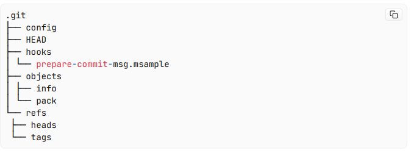

# GIT_GITHUB

## What is VCS?  
Ans:- VCS stands for Version Control System. It is a tool that helps manage and track changes to
source code or other files over time. VCS is essential for software development and other
projects where maintaining a history of changes, collaboration, and versioning is critical.
Popular VCS Tools:
Git The most widely used DVCS; supports branching and distributed workflows.
Subversion SVN A CVCS used in enterprise applications.
Mercurial Another DVCS, simpler than Git in some aspects.
Perforce A CVCS often used for large-scale enterprise projects.
Popular VCS Tools:
Git: The most widely used DVCS; supports branching and distributed workflows.
Subversion SVN A CVCS used in enterprise applications.
Mercurial: Another DVCS, simpler than Git in some aspects.
Perforce: A CVCS often used for large-scale enterprise projects.
Why do we need VCS?
 Tracking Changes It records changes to files over time, enabling developers to see who
changed what and when.

 Collaboration Multiple people can work on the same project simultaneously without
overwriting each other’s work.
 Branching and Merging Developers can create separate branches for different features or
experiments and later merge them into the main project.
 Version History It keeps a history of all changes, making it easy to revert to previous
versions if needed.
 Conflict Resolution Helps manage and resolve conflicts when multiple developers make
changes to the same file.
 Backup and Recovery: Acts as a backup for the project.

Introduction to Git
Git is a version control system VCS designed to track changes in source code and
collaborate efficiently with others. It is widely used for software development due to its
speed, flexibility, and support for non-linear workflows (e.g., branching and merging).
This what a typical git workflow in a startup or enterprise application code could look like.

# Git Basic Commands: 
   
   git init: Initialize a new empty git. 
             .git directory is created.
             

1. config is a text file that contains your git configuration for the current repo.
2. HEAD contains the current head of the repo.
3. hooks contain any scripts that can be run before/after git does anything.
4. objects contains the git objects, ie the data about the files, commits etc in your repo. 
5. We will go in depth into this in this blog.
6. refs as we previously mentioned, stores references(pointers)
7. 

   